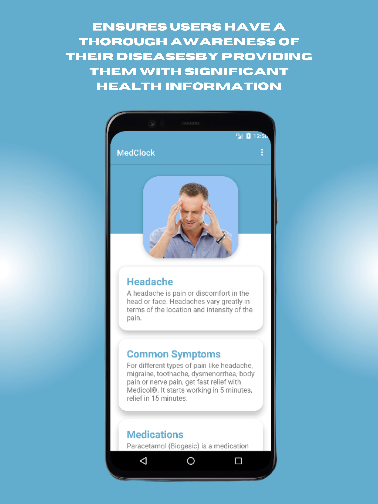

# MedClock: Timely Reminders for Your Medications

MedClock is mobile application intended to be your go-to assistant for monitoring and adhering to your medication schedule. We want to transform the way you take your medications with our user-friendly design and intelligent features, guaranteeing that your health and welfare are never compromised by missing doses or improper scheduling.
# Overview
The Alarm Manager is crucial for MedClock's functionality as a medicine reminder app. MedClock enhances user adherence to recommended treatments by providing timely and consistent medication reminders by utilizing the features of Alarm Manager. Alarm Manager's seamless connection guarantees users can reliably manage their prescription regimens, leading to better health results and general wellbeing.

# Requirements
Android Studio 4.0 (installed on a Mac, Linux, or Windows machine)
Android device in developer mode with USB debugging enabled
USB cable (to connect Android device to your computer)

# Features
1. Provide Significant Health Information
   
 

2. Display Medicine Schedule

 

3. Search Medicine Schedule

 

4. Set Alarm Schedule

 

5. Modify Medicine Schedule Information

 

6. Ignore Alarm

 

7. Take Medicine Confirmation

 

8. Cancel Alarm

 

9. View Alarm History

  

# Demo Video

Click the link to watch [MedClock Demo Video](https://www.example.com)

# Researcher/Developer:

•	Jesper Samson
•	Jerico Jobli
•	Junjun Capulong
•	Maricar Murcia

# Adviser:

•	Jefferson A. Costales

# School Name:

Eulogio "Amang" Rodriguez Insitute of Science and Technology
Nagtahan, Sampaloc, Manila, Philippines
College of Arts and Sciences
ITE Department

# Course:

•	Bachelor of Science in Information Technology

# Date:

•	July 30, 2023
   
